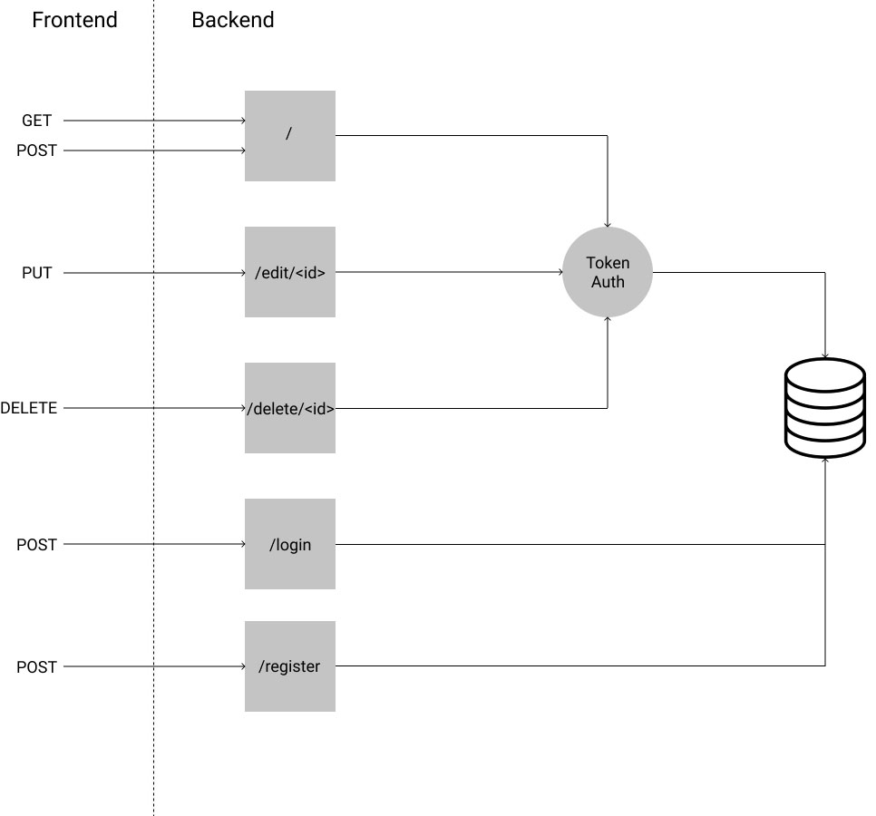

# Backend Architecture

# Backend endpoints

### /diarist/login
#### Method: POST
Takes a json object carrying username and password and returns a success marker and authentication token if information is valid.
#### Expects:
    {
    "username": <username>,
    "password": <password>
    }
#### Returns:
    {
    "status": "success"
    "token": <Authentication Token>
    }

### /diarist/register
#### Method: POST
Takes a json object carrying new user information and adds it to database. Returns success marker and authentication token if request is valid.
#### Expects:
    {
    "username": <username>,
    "email": <email>,
    "password": <password>
    }
#### Returns:
    {
    "status": "success",
    "token": <Authentication Token>
    }

### /diarist/

#### Method: GET
Takes a json object carrying auth token and returns json array of all journal entries from account associated with that token.
##### Expects:
    {
    "token": <Authentication Token>
    }
#### Returns:
    [{ 
    "id": <Journal Entry ID>,
    "title": <Journal Entry Title>,
    "body": <Journal Entry Body>,
    "created_at": <Journal Entry Creation DateTime>,
    "last_edited": <Journal Entry Last Edit DateTime>,
    "author": <Journal Author Email>
    }, ...
    ]
    
#### Method: POST
Takes a json object carrying auth token and new journal entry. Posts new journal entry. Returns data sent if successfully posted.

#### Expects
    {
    "token": <Authentication Token>,
    "title": <Journal Entry Title>,
    "body": <Journal Entry Body>
    }
#### Returns
    {
    "token": <Authentication Token>,
    "title": <Journal Entry Title>,
    "body": <Journal Entry Body>
	}

### /diarist/edit/<Journal Entry ID>

#### Method: PUT
Takes a json object carrying auth token and journal entry data. Updates journal entry associated with ID in 
url if authorization token is associated with journal entry author. Returns data sent if update is successfully posted.
#### Expects
    {
    "token": <Authentication Token>,
    "title": <Journal Entry Title>,
    "body": <Journal Entry Body>
    }
#### Returns
    {
    "token": <Authentication Token>,
    "title": <Journal Entry Title>,
    "body": <Journal Entry Body>
    }
    
### /diarist/delete/<Journal Entry ID>

#### Method: DELETE
Takes a json object carrying auth token. Deletes journal entry associated with ID in url if authorization token is associated with
journal entry author. Returns data sent if update is successfully posted.
#### Expects:
    {
    "token": <Authentication Token>
    }
#### Returns
    {
    "token": <Authentication Token>
    }
